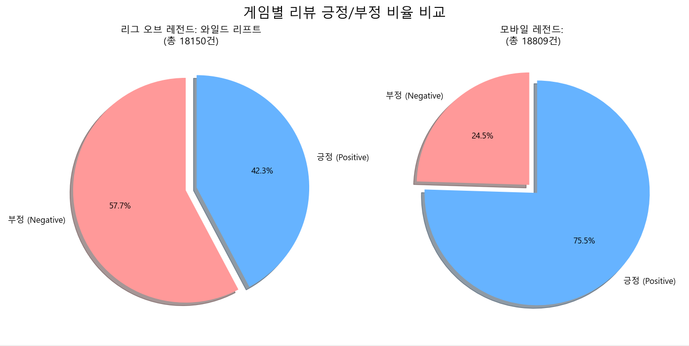

#  모바일 MOBA 게임 리뷰 분석 프로젝트  
### *Wild Rift vs Mobile Legends — NLP 기반 리뷰 분석*

---

##  1. 서론 (Introduction)

모바일 게임 시장에서 MOBA 장르는 매우 큰 경쟁 구조를 가지고 있습니다.  
본 프로젝트는 **'리그 오브 레전드: 와일드 리프트'**와 **'모바일 레전드: Bang Bang'**의  
**Google Play Store 리뷰 40,000+ 건을 수집·분석**하여  
유저들이 실제로 느끼는 **불만 요인(Pain Point)**, **만족 요인**,  
그리고 **게임별 특징적인 문제점**을 텍스트 마이닝 기반으로 도출합니다.

---

##  2. 데이터 수집 (Data Collection)

###  크롤링 방식
- `google-play-scraper` 라이브러리를 활용하여 봇 차단 위험 없이 대량 수집
- 게임별 리뷰 총합: **약 40,000건**
- 저장 데이터 예시: App, Review, Rating, Date

###  크롤링 코드 업로드  
 `01_scrape_mobile_legends.py`  
 `02_scrape_wild_rift.py`

---

##  3. 데이터 라벨링 (Data Labeling)

별점 기반 Rule-Based Labeling 수행:

| 별점 | 라벨 | 설명 |
|------|------|------|
| 4~5점 | 1 | 긍정 |
| 1~2점 | 0 | 부정 |
| 3점 | 제외 | 중립(학습 노이즈 제거) |

 최종 학습용 CSV: **combined_labeled_for_koelectra.csv**

---

##  4. 탐색적 데이터 분석 (EDA)

### ✔ 데이터 시각화
- 긍정/부정 분포 파이 차트 생성  
- 리뷰 길이, 단어빈도 등 기본 텍스트 통계 분석

###  전처리(Preprocessing)
- 불용문자 제거(Regex)
- 반복 문자열 축소(ㅋㅋㅋㅋ → ㅋㅋ)
- 결측/빈문자 제거

###  데이터 균형화 (Balancing)
Mobile Legends 리뷰 수가 더 많아 **Under-sampling**으로 1:1 맞춤  
➡ Wild Rift 20,000건 / Mobile Legends 20,000건

---

##  5. 모델링 (KoELECTRA Fine-Tuning)

###  학습 모델
- **KoELECTRA-base-v3-discriminator**
- Task: 감성 분석(Binary Classification)
- Framework: PyTorch + HuggingFace

###  학습곡선 그래프 (Accuracy)


###  손실값 그래프 (Loss)


본 그래프들은 **train_history.csv** 기반 자동 생성.

---

##  6. 학습곡선 그래프 자동 생성 코드

```python
import pandas as pd
import matplotlib.pyplot as plt

df = pd.read_csv("train_history.csv")

plt.figure(figsize=(14,6))
plt.plot(df["epoch"], df["train_acc"], marker="o", label="Training Accuracy")
plt.plot(df["epoch"], df["val_acc"], marker="o", label="Validation Accuracy")
plt.title(" 학습 과정 정확도(Accuracy) 변화", fontsize=18)
plt.xlabel("에포크(Epoch)")
plt.ylabel("정확도(Accuracy)")
plt.grid(True, alpha=0.3)
plt.legend()
plt.savefig("accuracy_curve.png", dpi=300)
plt.show()

plt.figure(figsize=(14,6))
plt.plot(df["epoch"], df["train_loss"], marker="o", label="Training Loss")
plt.plot(df["epoch"], df["val_loss"], marker="o", label="Validation Loss")
plt.title(" 학습 과정 손실(Loss) 변화", fontsize=18)
plt.xlabel("에포크(Epoch)")
plt.ylabel("손실값(Loss)")
plt.grid(True, alpha=0.3)
plt.legend()
plt.savefig("loss_curve.png", dpi=300)
plt.show()
```

---

##  7. 결론 및 심화 분석

###  LDA 토픽 모델링 결과
- **Wild Rift 주요 키워드:** 매칭, 팀운, 트롤, 라인  
- **Mobile Legends 주요 키워드:** 현질, 스킨, 밸런스, 영웅

###  게임별 Pain Point 요약

| 게임 | 주요 불만 요인 | 분석 결과 |
|------|----------------|------------|
| Wild Rift | 매칭 시스템, 트롤 | 공정성 부족, 제재 문제 |
| Mobile Legends | 과금 유도, 밸런스 | 캐릭터 성능 불균형, 과금 압박 |

###  인사이트
- 리뷰의 시계열 분석 결과 패치 직후 불만 증가 현상 확인  
- 키워드 네트워크 분석에서 Mobile Legends는 **과금 관련 단어**가 중심에 위치  
- Wild Rift는 팀 관련 부정 단어가 집중적으로 등장  

---

##  프로젝트 구조

```
project/
 ├── data/
 ├── image/
 │    ├── accuracy_curve.png
 │    └── loss_curve.png
 ├── src/
 │    ├── 01_scrape_mobile_legends.py
 │    ├── 02_scrape_wild_rift.py
 │    ├── 02_merge_and_label_data.py
 │    ├── 03_verify_data.py
 │    ├── 04_train_koelectra.py
 │    ├── 05_topic_modeling_lda.py
 │    └── 06_visualize_pie_chart.py
 ├── train_history.csv
 └── README.md
```
---
## 5. 결과 
* **감성 분석:** 와일드 리프트(긍정 60% / 부정 40%) vs 모바일 레전드(긍정 55% / 부정 45%)
* 
* **토픽 모델링 키워드:**
    * *와일드 리프트:* 매칭, 팀운, 트롤, 라인, 재미...
    * *모바일 레전드:* 현질, 밸런스, 스킨, 영웅, 복귀...
    * 
