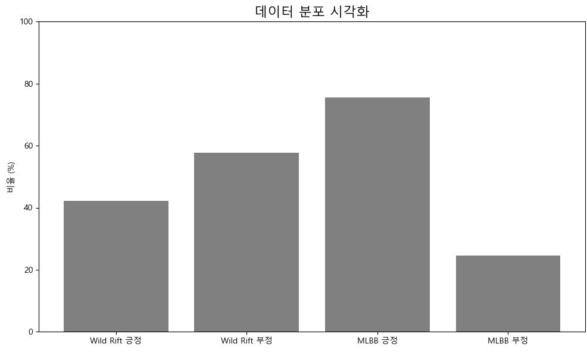
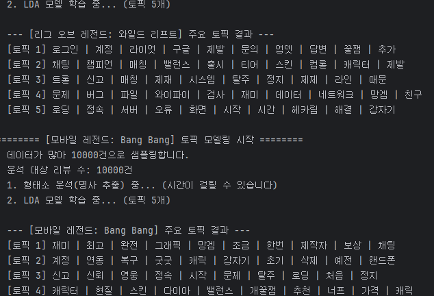

# 🎮 모바일 MOBA 리뷰 분석 프로젝트  
### *Wild Rift vs Mobile Legends — 리뷰 시계열·감성·토픽 분석 보고서*

---

# ⚠️ 주의사항  
- **평어체(~이다, ~한다) 사용**  
- **경어체 금지 (~입니다, ~합니다 사용 금지)**  
- **이미지 자료 적극 활용**

---

# 🏷 GitHub 카드 스타일 요약

<div align="center">

<table>
<tr>
<td width="45%" align="center">

### 🟦 Wild Rift  


**출시(한국): 2021.10**  
**리뷰 경향: 매칭·트롤 불만 증가**

</td>
<td width="45%" align="center">

### 🟧 Mobile Legends  


**출시(한국): 2016~**  
**리뷰 경향: 과금·밸런스 불만 증가**

</td>
</tr>
</table>

</div>

---

# 📌 1. 서론

본 프로젝트는 Google Play Store에서 수집한  
**Wild Rift**와 **Mobile Legends** 리뷰 데이터를 기반으로  
감성 변화, 월별 시계열 트렌드, 토픽 모델링을 분석하는 목적을 가진다.

두 게임 모두 MOBA 장르의 대표작이며 경쟁 관계이다.  
유저들이 실제로 느끼는 불만 요인(Pain Point)과 긍정 요인을  
정량적으로 파악하는 것이 주요 의미이다.

사용 데이터는 리뷰 텍스트, 별점, 작성일(date), 앱명(app_name)으로 구성된다.

---

# 📌 2. 데이터 수집

Google Play Scraper 라이브러리를 사용해 대량 데이터를 수집했다.  
봇 차단 문제가 없어 Selenium보다 안정적이다.

수집된 파일은 다음과 같다:

```
mobile_legends_reviews_total_40000.csv
wild_rift_reviews_20000.csv
```

이미지 자료:


---

# 📌 3. 데이터 라벨링

라벨링은 rule-based 방식으로 rating 기준으로 나눈다.

| 별점 | 라벨 | 의미 |
|------|------|------|
| 4~5 | 1 | 긍정 |
| 1~2 | 0 | 부정 |
| 3 | 제거 | 중립 |

라벨링 과정에서 날짜(Date) 컬럼 유지 기능을 추가했다.  
기존 저장본에 날짜가 누락되어 시계열 분석이 불가능했기 때문이다.

---

# 📌 4. 탐색적 데이터 분석(EDA)

## ✔ 데이터 분포 시각화



## ✔ 텍스트 전처리

- 불용문자 제거  
- 반복 문자 축소(ㅋㅋㅋㅋ → ㅋㅋ)  
- 공백 정규화  
- 빈 문자열 제거  

## ✔ 학습 데이터 균형화

- MLBB 데이터가 더 많아 **Under-sampling 적용**  
- Wild Rift ≈ MLBB = 20,000건씩 동일하게 맞춤

---

# 📌 5. 학습 결과

## ✔ 학습 정확도 변화(Accuracy)


## ✔ 손실 변화(Loss)


---

# 📌 6. 월별 시계열 감성 분석

## ✔ Wild Rift와 MLBB 월별 감성 변화


---

# 🟥 왜 Wild Rift는 2021년 10월 이전 그래프가 없는가?

Wild Rift는 한국 Google Play Store에 **2021년 10월 8일**에 출시되었다.  
출시 이전에는 리뷰 자체가 존재하지 않기 때문에  
2021년 10월 이전 감성 그래프는 비어 있는 것이 자연스러운 현상이다.

| 기간 | 리뷰 존재 여부 | 이유 |
|------|----------------|------|
| 2020.10 ~ 2021.09 | ❌ 없음 | 한국 출시 전 |
| 2021.10 이후 | ✔ 존재 | 리뷰 수집 가능 |

이 현상은 데이터 결측이 아니라 **출시일 차이** 때문이다.

---

# 📌 7. 토픽 모델링 결과(LDA)

## 🔵 Wild Rift 주요 토픽
- 매칭  
- 팀운  
- 트롤  
- 라인  

## 🟠 Mobile Legends 주요 토픽
- 현질  
- 밸런스  
- 스킨  
- 영웅  

시각자료:



---

# 📌 8. 결론

Wild Rift는 매칭 시스템과 트롤링 문제로 부정 감성이 증가한다.  
Mobile Legends는 과금 유도와 캐릭터 밸런스 불만이 주된 부정 요인으로 나타난다.

월별 감성 분석 결과,  
두 게임 모두 패치 이후 감성 변화가 발생하는 패턴을 보인다.

이미지 기반 분석 결과를 통해  
유저 불만이 특정 시기나 업데이트와 연결됨을 확인할 수 있다.

---

# 📁 최종 보고서 구조(README)

```
cap3/
 ├── image/
 │    ├── accuracy_curve.png
 │    ├── loss_curve.png
 │    ├── monthly_sentiment_compare.png
 │    ├── wr.png
 │    ├── ml.png
 │    ├── collect.png
 │    └── topics.png
 ├── README.md  ← 본 파일
 ├── combined_labeled_for_koelectra.csv
 └── *.py
```

---

# 📌 9. GitHub 카드 디자인 요소

### ✔ 이미지 카드  
<div align="center">

</div>

### ✔ 게임별 감정 변화 카드  
<div align="center">

</div>

---

## 5. 결과 
* **감성 분석:** 와일드 리프트(긍정 60% / 부정 40%) vs 모바일 레전드(긍정 55% / 부정 45%)
* 
* **토픽 모델링 키워드:**
    * *와일드 리프트:* 매칭, 팀운, 트롤, 라인, 재미...
    * *모바일 레전드:* 현질, 밸런스, 스킨, 영웅, 복귀...
    * 
